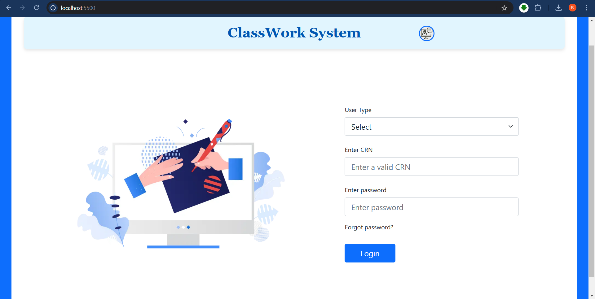
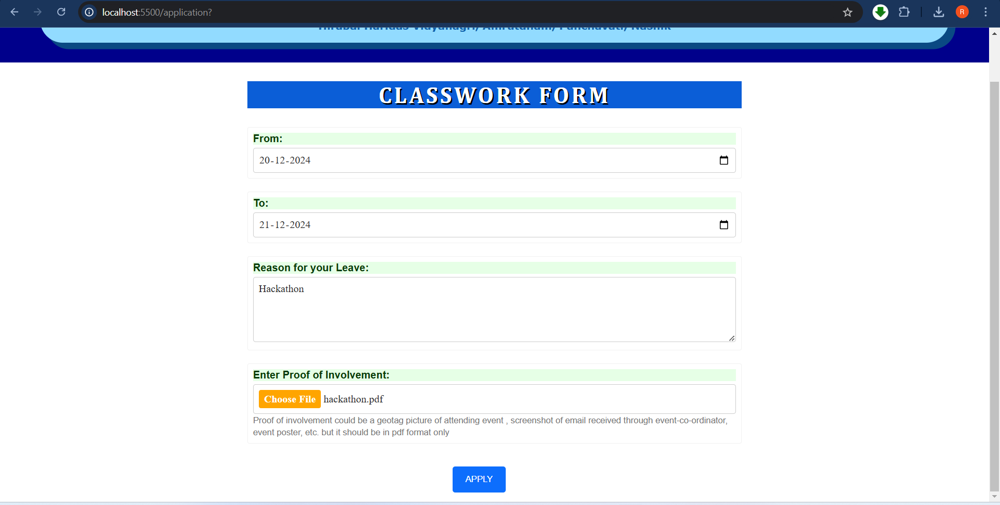
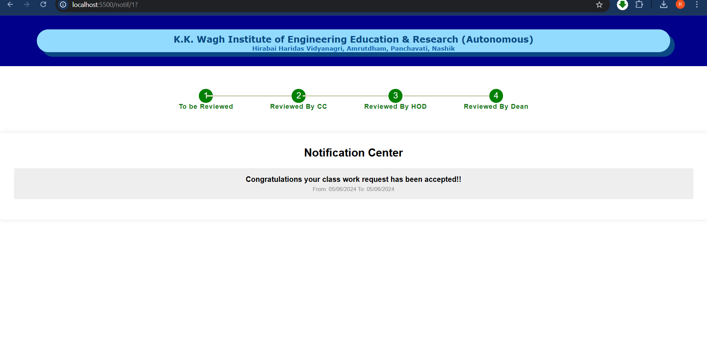
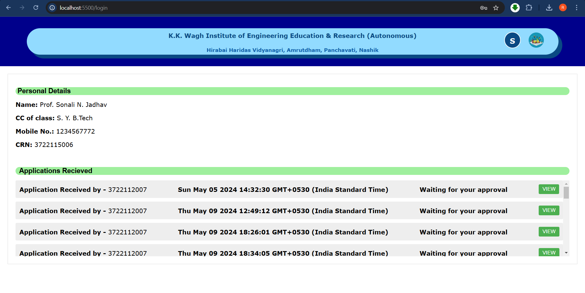
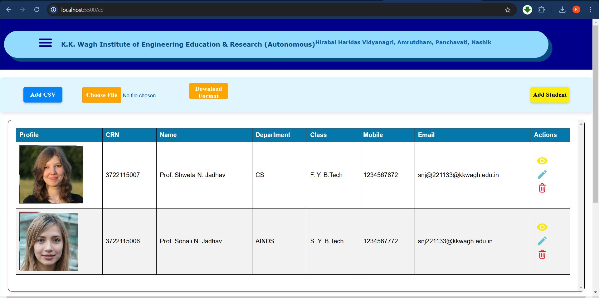

# Online Classwork System

## Overview
The **Online Classwork System** is a comprehensive web application designed to streamline the management and approval process of classwork requests within an academic institution. The platform features role-based modules for students, class coordinators, heads of departments (HODs), deans, and administrators to ensure a seamless workflow.

---

## Tech Stack
- **Handlebars**: Frontend templating engine for dynamic HTML rendering.
- **MongoDB**: NoSQL database for secure and scalable data storage.
- **Node.js**: Runtime environment for executing server-side JavaScript.
- **Express.js**: Web application framework for building APIs and managing routes.

---

## Features

### Admin Module
The Admin module provides comprehensive CRUD (Create, Read, Update, Delete) operations for managing institutional records:
- Add, delete, update, and view students, class coordinators, HODs, and records in bulk or individually.
- Centralized control for managing user roles and institutional data.

### Class Coordinator, HOD, and Dean Modules
These modules handle the hierarchical approval process for student classwork requests:
1. A student submits a classwork request.
2. The **Class Coordinator** reviews and either approves or rejects the request.
3. If approved, the request moves to the **HOD** for further review.
4. Finally, the request is forwarded to the **Dean** for final approval.

### Student Module
Students can:
- View their profile.
- Apply for classwork if their attendance is **≥ 75%**.
- Submit requests with the following details:
  - **Leave Start Date and End Date**
  - **Reason**
  - **Proof** (attachment support included).

### Login Module
- Secure login for all roles (students, coordinators, HODs, deans, and admin).
- Authentication is based on the unique **CRN** (College Registration Number).
- Passwords are hashed before being stored in the MongoDB database for enhanced security.

---

## Workflow
1. **Student Request Submission**
   - Students submit a classwork request if they meet the attendance criteria.
   - Requests include start/end dates, reason, and proof.

2. **Approval Process**
   - Requests are reviewed in sequence:
     - **Class Coordinator** → **HOD** → **Dean**.
   - Each reviewer can approve or reject the request.

3. **Admin Oversight**
   - Admins maintain full control of the system, including bulk management of data and access control.

---

## Installation

1. Clone the repository:
   ```bash
   git clone https://github.com/rasikathakur/OnlineCWorkSystem.git
   ```
2. Navigate to the project directory:
   ```bash
   cd OnlineCWorkSystem
   ```
3. Install dependencies:
   ```bash
   npm install
   ```
4. Set up MongoDB and update the configuration file with your database credentials.

5. Start the application:
   ```bash
   npm run dev
   ```
6. Open your browser and navigate to:
   ```
   http://localhost:3000
   ```

---

## Pictures
### Login Page


### Student Module





### Class Coordinator Module, Head of Department Module, Dean Module



### Admin Module


---

## Contributing
We welcome contributions! To contribute:
1. Fork the repository.
2. Create a feature branch:
   ```bash
   git checkout -b feature/YourFeature
   ```
3. Commit your changes:
   ```bash
   git commit -m "Add your message here"
   ```
4. Push to the branch:
   ```bash
   git push origin feature/YourFeature
   ```
5. Submit a pull request.

---

## Contact
For any queries, feel free to reach out:
- **Email**: rasikathakur303@gmail.com / sohampilot0@gmail.com
